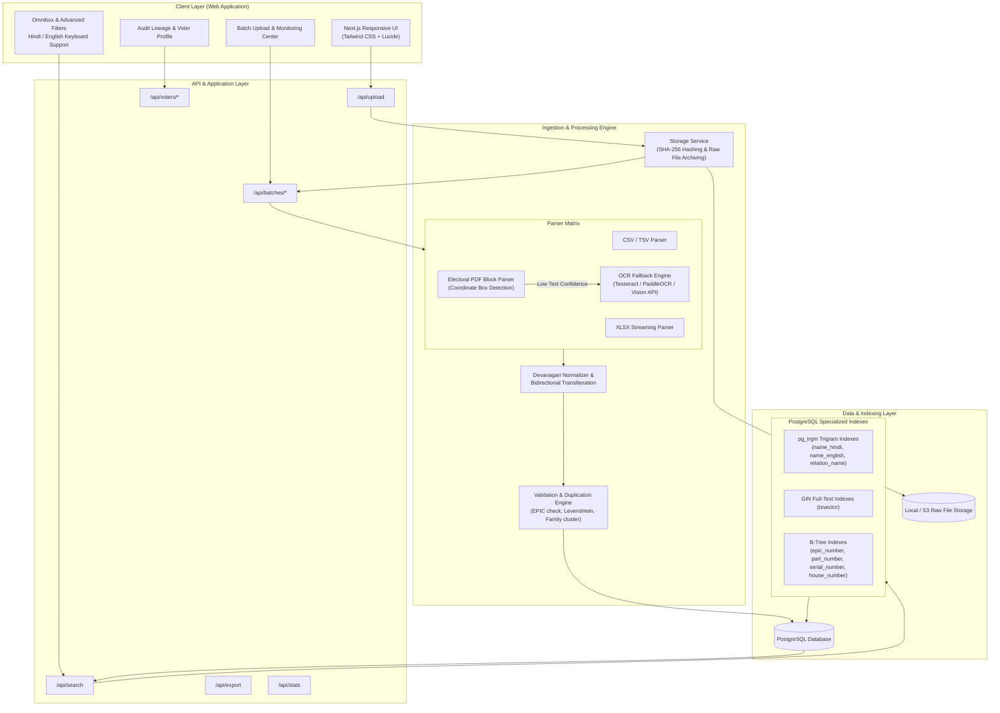
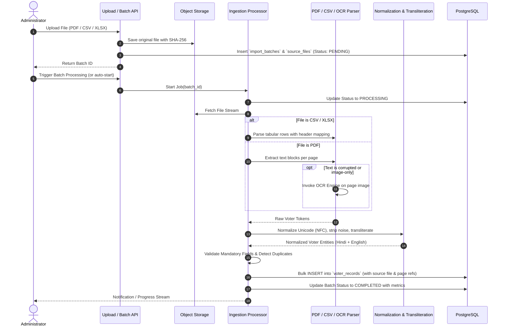

# Election Voter Data Search Platform — System Architecture

## 1. Executive Summary

The **Election Voter Data Search Platform** is a high-throughput, multi-lingual electoral roll ingestion and search engine. It is architected to ingest electoral roll data from various formats (structured CSV/XLSX, standard digital electoral roll PDFs, and scanned electoral rolls requiring OCR fallback), persist the original raw files with full cryptographic provenance, extract and normalize voter records in both Devanagari (Hindi) and Latin (English) scripts, and provide millisecond-latency compound search across millions of records.

---

## 2. Core Architectural Principles

1. **Raw File Preservation & Cryptographic Immutability**:
   Every uploaded file (PDF/CSV/XLSX) is preserved verbatim in object/file storage with a SHA-256 hash. No record is ever ingested without a verifiable pointer back to its `source_file_id`, `source_page_number`, `source_serial_number`, and `import_batch_id`.

2. **Decoupled Ingestion Pipeline**:
   The ingestion system is isolated from the query and search layer. Ingestion operations are executed via a staged state machine:
   `Upload` → `Storage` → `Text Extraction` → `OCR Fallback (if confidence < threshold)` → `Devanagari/Latin Normalization` → `Entity & Relation Parsing` → `Validation & Deduplication` → `Database Bulk Ingest` → `Search Index Synchronization`.

3. **Multi-Lingual Dual-Script Representation**:
   Because Indian electoral rolls frequently feature names in Hindi, English, or transliterated forms, every voter entity stores both `name_hindi` and `name_english` (generated via bidirectional rule-based & phonetic transliteration), alongside phonetic sound keys and trigram vector representations.

4. **Layered Search Strategy**:
   Search does not rely on naive wildcard scans. It executes a multi-tiered query:
   - **Tier 1**: Exact indexed match on EPIC (Voter ID) or (Part No + Serial No).
   - **Tier 2**: Normalized phonetic + trigram similarity on voter names and relative names.
   - **Tier 3**: Compound relational filtering (House Number, Ward, Booth, Age range, Gender, Relation type).

5. **Modularity and Pluggable OCR Services**:
   The OCR and PDF parsing subsystems communicate via standardized interfaces (`OcrProvider`, `DocumentParser`), allowing zero-downtime upgrades from CPU-based Tesseract to GPU-accelerated PaddleOCR or cloud vision models.

---

## 3. High-Level System Architecture Diagram

---

## 4. Ingestion Pipeline Stages

---

## 5. Component Breakdown

### 5.1 Storage Layer (`src/lib/storage/`)
- Manages raw uploaded artifacts.
- Automatically computes SHA-256 checksums to ensure zero accidental file tampering.
- Stores files systematically: `uploads/{batch_id}/{sha256}_{original_filename}`.

### 5.2 NLP & Transliteration Layer (`src/lib/nlp/`)
- **Devanagari Normalizer**: Solves Unicode divergence (NFC vs NFD), strips invalid zero-width characters (`\u200B`, `\u200C`, `\u200D`), unifies Devanagari Danda (`।`) and nukta variations (`ड़` vs `ड + ़`).
- **Transliteration Engine**: Bidirectional phoneme mapping based on standard Indic transliteration schemes (ITRANS / Harvard-Kyoto / modified Soundex for Hindi names).
- Enables users searching for `"Suresh"` to match `"सुरेश"` and vice versa.

### 5.3 Parser & OCR Matrix (`src/lib/parsers/`)
- **Tabular Parser**: Handles standard state-wise electoral CSV/Excel exports with automated schema detection (EPIC, Name, Father/Husband, Age, Gender, House No, etc.).
- **PDF Layout Parser**: Detects the standard 30-box electoral roll grid per page, extracts coordinates, parses relative relationships (`पिता`, `पति`, `माता`, `अन्य`), and extracts EPIC codes from the top-right header box.
- **Pluggable OCR**: Abstract interface for OCR backends. In Phase 1, incorporates clean heuristic text recovery with fallback handlers; fully prepared for Tesseract / PaddleOCR / cloud OCR worker nodes.

### 5.4 Search Engine (`src/lib/search/`)
- Generates dynamic, parameterized PostgreSQL queries using trigram similarity (`similarity(name_english, $1) > 0.3`), full-text search tsvectors, and exact B-Tree lookups.
- Employs weighted relevance ranking:
  - Exact EPIC match: **100 pts**
  - Exact Name match (Hindi or English): **50 pts**
  - Trigram fuzzy Name match: **20-40 pts**
  - House Number & Ward match: **15 pts**
  - Relative Name match: **10 pts**

---

## 6. Auditability & Provenance Architecture

Every single row in `voter_records` maintains strict data lineage:
- `import_batch_id`: Foreign key to `import_batches`.
- `source_file_id`: Foreign key to `source_files`.
- `source_page_number`: Exact page in the source PDF where the voter appeared (1-indexed).
- `source_serial_number`: The serial number within the part/page.
- `raw_extracted_text`: JSON blob preserving the un-normalized raw text block extracted by the parser before any transformation.
- `extraction_confidence`: Float score (0.00 to 1.00) reflecting parser/OCR confidence.
- `validation_status`: `VALID`, `WARNING`, `DUPLICATE`, or `REJECTED`.
