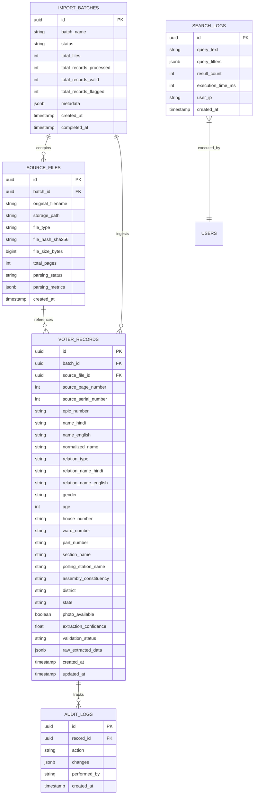

# Election Voter Data Search Platform — Database Architecture

## 1. Overview & Objectives

The database architecture is designed for **high-throughput ingestion**, **data provenance tracking**, and **sub-50ms multi-lingual fuzzy query execution** across millions of voter records.

The underlying engine is **PostgreSQL (v14+)**, taking full advantage of:
- `pg_trgm` extension for typo-tolerant trigram search and GIST/GIN indexing.
- `unaccent` for accent-insensitive search.
- Native `tsvector` and `tsquery` full-text search.
- Partition-friendly table design (by `assembly_constituency` or `import_batch_id` if sharding is required).

---

## 2. Entity-Relationship Schema Diagram



---

## 3. Detailed DDL Specification

```sql
-- Enable required extensions
CREATE EXTENSION IF NOT EXISTS "uuid-ossp";
CREATE EXTENSION IF NOT EXISTS "pg_trgm";
CREATE EXTENSION IF NOT EXISTS "unaccent";

-- 1. Import Batches Table
CREATE TABLE IF NOT EXISTS import_batches (
    id UUID PRIMARY KEY DEFAULT uuid_generate_v4(),
    batch_name VARCHAR(255) NOT NULL,
    status VARCHAR(50) NOT NULL DEFAULT 'PENDING' CHECK (status IN ('PENDING', 'PROCESSING', 'COMPLETED', 'FAILED', 'PARTIAL')),
    total_files INT NOT NULL DEFAULT 0,
    total_records_processed INT NOT NULL DEFAULT 0,
    total_records_valid INT NOT NULL DEFAULT 0,
    total_records_flagged INT NOT NULL DEFAULT 0,
    error_message TEXT,
    metadata JSONB DEFAULT '{}'::jsonb,
    created_at TIMESTAMPTZ NOT NULL DEFAULT NOW(),
    updated_at TIMESTAMPTZ NOT NULL DEFAULT NOW(),
    completed_at TIMESTAMPTZ
);

-- 2. Source Files Table (Raw File Audit Lineage)
CREATE TABLE IF NOT EXISTS source_files (
    id UUID PRIMARY KEY DEFAULT uuid_generate_v4(),
    batch_id UUID NOT NULL REFERENCES import_batches(id) ON DELETE CASCADE,
    original_filename VARCHAR(512) NOT NULL,
    storage_path VARCHAR(1024) NOT NULL,
    file_type VARCHAR(50) NOT NULL CHECK (file_type IN ('PDF', 'CSV', 'XLSX', 'IMAGE')),
    file_hash_sha256 CHAR(64) NOT NULL,
    file_size_bytes BIGINT NOT NULL,
    total_pages INT DEFAULT 1,
    parsing_status VARCHAR(50) NOT NULL DEFAULT 'PENDING' CHECK (parsing_status IN ('PENDING', 'PARSING', 'SUCCESS', 'FAILED', 'PARTIAL_OCR')),
    parsing_metrics JSONB DEFAULT '{}'::jsonb,
    created_at TIMESTAMPTZ NOT NULL DEFAULT NOW(),
    updated_at TIMESTAMPTZ NOT NULL DEFAULT NOW()
);

-- 3. Voter Records Table
CREATE TABLE IF NOT EXISTS voter_records (
    id UUID PRIMARY KEY DEFAULT uuid_generate_v4(),
    batch_id UUID NOT NULL REFERENCES import_batches(id) ON DELETE CASCADE,
    source_file_id UUID NOT NULL REFERENCES source_files(id) ON DELETE CASCADE,
    source_page_number INT DEFAULT 1,
    source_serial_number INT NOT NULL,
    
    -- Core Identity
    epic_number VARCHAR(50),
    name_hindi VARCHAR(255) NOT NULL,
    name_english VARCHAR(255) NOT NULL,
    normalized_name VARCHAR(255) NOT NULL,
    
    -- Family Relation
    relation_type VARCHAR(20) CHECK (relation_type IN ('FATHER', 'HUSBAND', 'MOTHER', 'OTHER', 'UNKNOWN')),
    relation_name_hindi VARCHAR(255),
    relation_name_english VARCHAR(255),
    
    -- Demographics
    gender VARCHAR(20) CHECK (gender IN ('MALE', 'FEMALE', 'OTHER', 'THIRD_GENDER', 'UNKNOWN')),
    age INT CHECK (age >= 18 AND age <= 130),
    
    -- Location & Electoral Metadata
    house_number VARCHAR(100),
    ward_number VARCHAR(100),
    part_number VARCHAR(100),
    section_name TEXT,
    polling_station_name TEXT,
    assembly_constituency VARCHAR(255),
    district VARCHAR(255),
    state VARCHAR(255) DEFAULT 'INDIA',
    photo_available BOOLEAN DEFAULT FALSE,
    
    -- Extraction & Quality Assurance
    extraction_confidence NUMERIC(4,3) DEFAULT 1.000 CHECK (extraction_confidence >= 0.0 AND extraction_confidence <= 1.0),
    validation_status VARCHAR(50) DEFAULT 'VALID' CHECK (validation_status IN ('VALID', 'WARNING', 'DUPLICATE', 'REJECTED')),
    raw_extracted_data JSONB DEFAULT '{}'::jsonb,
    
    created_at TIMESTAMPTZ NOT NULL DEFAULT NOW(),
    updated_at TIMESTAMPTZ NOT NULL DEFAULT NOW()
);

-- 4. Search Audit & Analytics Log
CREATE TABLE IF NOT EXISTS search_logs (
    id UUID PRIMARY KEY DEFAULT uuid_generate_v4(),
    query_text TEXT,
    query_filters JSONB,
    result_count INT NOT NULL DEFAULT 0,
    execution_time_ms INT NOT NULL DEFAULT 0,
    user_ip VARCHAR(100),
    created_at TIMESTAMPTZ NOT NULL DEFAULT NOW()
);

-- 5. Audit Trail for Record Changes
CREATE TABLE IF NOT EXISTS audit_logs (
    id UUID PRIMARY KEY DEFAULT uuid_generate_v4(),
    record_id UUID REFERENCES voter_records(id) ON DELETE SET NULL,
    action VARCHAR(50) NOT NULL,
    changes JSONB NOT NULL,
    performed_by VARCHAR(255) DEFAULT 'SYSTEM',
    created_at TIMESTAMPTZ NOT NULL DEFAULT NOW()
);
```

---

## 4. Specialized Indexing Strategy

To achieve sub-50ms search response times across large datasets, the following indexes are deployed:

```sql
-- Trigram Indexes for Fuzzy / Typo-Tolerant Text Search
CREATE INDEX IF NOT EXISTS idx_voter_name_english_trgm 
    ON voter_records USING gin (name_english gin_trgm_ops);

CREATE INDEX IF NOT EXISTS idx_voter_name_hindi_trgm 
    ON voter_records USING gin (name_hindi gin_trgm_ops);

CREATE INDEX IF NOT EXISTS idx_voter_rel_name_english_trgm 
    ON voter_records USING gin (relation_name_english gin_trgm_ops);

CREATE INDEX IF NOT EXISTS idx_voter_rel_name_hindi_trgm 
    ON voter_records USING gin (relation_name_hindi gin_trgm_ops);

-- Exact & Partial B-Tree Indexes for Fast Filtering
CREATE INDEX IF NOT EXISTS idx_voter_epic_number 
    ON voter_records (UPPER(TRIM(epic_number)));

CREATE INDEX IF NOT EXISTS idx_voter_part_serial 
    ON voter_records (part_number, source_serial_number);

CREATE INDEX IF NOT EXISTS idx_voter_ward_house 
    ON voter_records (ward_number, house_number);

CREATE INDEX IF NOT EXISTS idx_voter_assembly 
    ON voter_records (assembly_constituency);

CREATE INDEX IF NOT EXISTS idx_voter_batch_source 
    ON voter_records (batch_id, source_file_id);

CREATE INDEX IF NOT EXISTS idx_voter_validation_status 
    ON voter_records (validation_status);

-- Composite Index for Compound Queries
CREATE INDEX IF NOT EXISTS idx_voter_compound_filter 
    ON voter_records (assembly_constituency, part_number, ward_number, gender);
```

---

## 5. Duplicate Detection & Data Integrity Strategy

1. **Deduplication Key Formulation**:
   - Primary unique candidate: `(UPPER(TRIM(epic_number)))` where EPIC is not null and length >= 6.
   - Secondary candidate (local duplicate): `(assembly_constituency, part_number, source_serial_number)`.
   - Fuzzy match check: `(normalized_name, relation_name_english, age ± 1, house_number, part_number)`.

2. **Ingestion Conflict Resolution**:
   - If an identical EPIC exists from an older batch, the system flags the newly ingested record with `validation_status = 'DUPLICATE'` and references the prior record in `raw_extracted_data.duplicate_of_id`, rather than discarding data silently.
   - Administrators can review duplicate records in the verification console.
