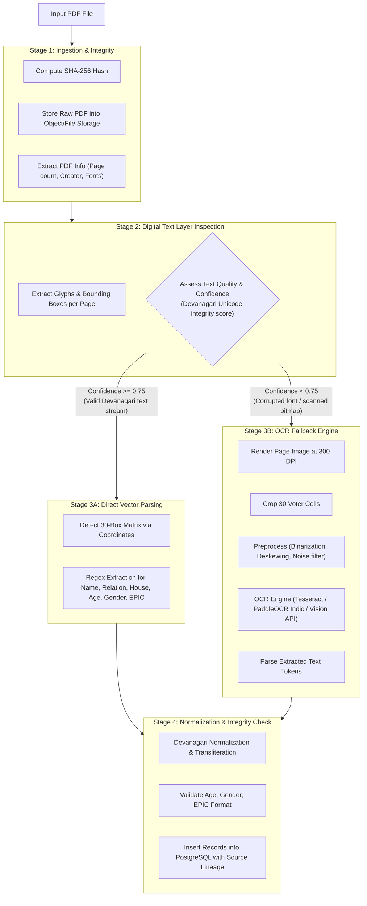

# Election Voter Data Search Platform — PDF Processing & OCR Strategy

## 1. Overview & Document Structure

Standard Indian electoral roll PDFs (Mother Rolls and Supplementary Rolls) are structured in a tabular grid:
- **Header Section**: Part Number, Assembly Constituency, Polling Station, Revision Year, and Date.
- **Voter Grid**: Typically 30 voter boxes per page arranged in a 3-column × 10-row matrix.
- **Summary Section**: Last page containing statistical totals and signature blocks.

---

## 2. Anatomical Anatomy of an Electoral Voter Box

```
+-------------------------------------------------------------+
| 142                       |                     WB/12/34567 |  <- (Serial No & EPIC)
+-------------------------------------------------------------+
| निर्वाचक का नाम:    रमेश कुमार                                |  <- (Voter Name)
| पिता का नाम:        सुरेश कुमार                               |  <- (Relation Type & Name)
| गृह संख्या:          42-B                                    |  <- (House Number)
| उम्र: 38            लिंग: पुरुष                               |  <- (Age & Gender)
|                                           [PHOTO AVAILABLE] |  <- (Photo Box)
+-------------------------------------------------------------+
```

---

## 3. Two-Tier Processing Pipeline: Text Layer vs OCR Fallback



---

## 4. Hindi Text Corruption Mitigations

Electoral roll PDFs generated by legacy state election management systems frequently suffer from:
1. **Custom Legacy 8-bit Encoding (KrutiDev, DevLys, Walkman-Chanakya)**: In older PDFs, characters look like Hindi on screen but decode to arbitrary ASCII characters (`jkes'k` for `रमेश`).
   - *Mitigation*: Automated legacy font map conversion or automatic diversion to the rasterization OCR path.
2. **Missing Devanagari Unicode Matras**: When extracting raw text streams, vowel diacritics (matras) may be placed before the consonant or separated by whitespace.
   - *Mitigation*: Post-extraction Unicode normalization pipeline reorders halant/matra tokens into canonical Devanagari Unicode code-points.
3. **EPIC Header Distortion**: EPIC IDs in the top-right box may have overlapping characters.
   - *Mitigation*: Standard regex matching pattern for Indian EPIC numbers (`[A-Z]{3}[0-9]{7}` or state-specific formats like `[A-Z]{2}/[0-9]{2}/[0-9]{3}/[0-9]{6}`).

---

## 5. Pluggable OCR Interface Architecture

The platform defines a clean TypeScript interface for OCR engines:

```typescript
export interface OcrBoundingBox {
  x: number;
  y: number;
  width: number;
  height: number;
}

export interface OcrResult {
  text: string;
  confidence: number;
  boxes?: OcrBoundingBox[];
}

export interface OcrProvider {
  name: string;
  isAvailable(): Promise<boolean>;
  recognizeText(imageBuffer: Buffer, lang?: string): Promise<OcrResult>;
  recognizePageBoxes(pageImageBuffer: Buffer): Promise<OcrResult[]>;
}
```

In Phase 1, the system includes structured heuristic text extractors and the mock/standard adapter, ready for zero-friction expansion to Tesseract OCR, PaddleOCR Indic, or cloud vision workers.
