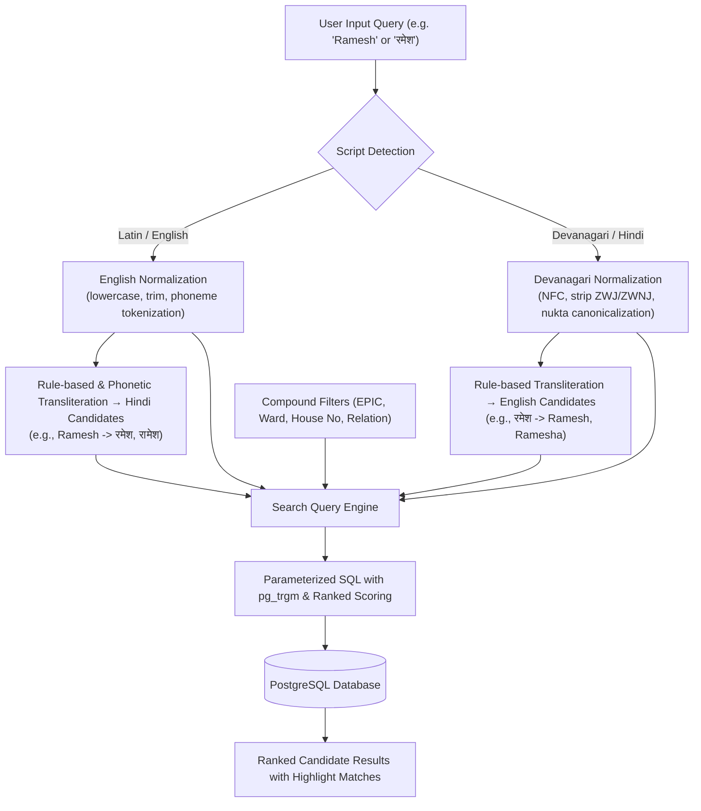

# Election Voter Data Search Platform — Search & Transliteration Strategy

## 1. Overview & Search Challenges

Searching electoral data across India presents unique algorithmic challenges:
1. **Script Duality**: Voters may search in English ("Rajesh Sharma") or Hindi ("राजेश शर्मा").
2. **Spelling Divergence**: Phonetically identical Hindi names have multiple English spellings (e.g., *Laxmi / Lakshmi / Laxmee*, *Vikas / Bikash*, *Choudhary / Chowdhary / Choudhari*).
3. **Devanagari Unicode Inconsistencies**: Distinct code-points for visually identical glyphs (NFC vs NFD, nukta modifiers, zero-width spaces, Chandrabindu vs Anusvara).
4. **OCR & Scanning Corruption**: Subtle character drops or font distortions in PDF extraction.

---

## 2. Multi-Lingual & Transliteration Architecture



---

## 3. Devanagari Normalization Specification

Every Hindi text token ingested or queried is processed through a strict normalization filter:

1. **Unicode Canonical Normalization**: Convert all strings using Unicode Normalization Form C (`NFC`).
2. **Zero-Width Character Removal**: Strip `\u200B` (Zero Width Space), `\u200C` (ZWNJ), and `\u200D` (ZWJ) which break byte-level string comparisons.
3. **Nukta Harmonization**: Unify composite nukta characters:
   - `क़` (U+0915 + U+093C) ↔ `क` (for fuzzy fallback)
   - `फ़` (U+092B + U+093C) ↔ `फ`
   - `ज़` (U+091C + U+093C) ↔ `ज`
   - `ड़` (U+0921 + U+093C) ↔ `ड`
4. **Vowel & Diacritic Standardization**:
   - Canonicalize Chandrabindu (`ँ`) with Anusvara (`ं`).
   - Clean double matras or stray viramas (`्`).

---

## 4. English ↔ Hindi Bidirectional Transliteration Engine

The system uses an Indic phonetic rule matrix covering consonants, compound conjuncts (*samyuktakshar*), and vowel mappings:

### 4.1 Consonant & Conjunct Mappings
| English Token | Primary Devanagari | Secondary / Alternate |
|---|---|---|
| `sh`, `shh` | `श` / `ष` | `स` |
| `ch`, `chh` | `च` / `छ` | `च` |
| `th` | `थ` / `ठ` | `त` |
| `dh` | `ध` / `ढ` | `द` |
| `bh` | `भ` | `ब` |
| `gh` | `घ` | `ग` |
| `kh` | `ख` | `क` |
| `v`, `w` | `व` | `ब` |
| `y`, `j` | `य` / `ज` | `ज` |
| `gy`, `dny` | `ज्ञ` | `ग्य` |
| `kr`, `cr` | `क्र` | `कर` |
| `tr` | `त्र` | `तर` |

### 4.2 Query Expansion
When a user searches for `"Vikram"`, the search service expands the candidate set:
- Primary English: `vikram`
- Transliterated Hindi Candidates: `['विक्रम', 'बिक्रम', 'विक्रमा']`
- Trigram similarity targets: both `name_english` and `name_hindi`.

---

## 5. Multi-Tiered SQL Search Query Builder

The PostgreSQL search executor uses dynamic weighted scoring:

```sql
SELECT 
    id,
    epic_number,
    name_hindi,
    name_english,
    relation_type,
    relation_name_hindi,
    relation_name_english,
    gender,
    age,
    house_number,
    ward_number,
    part_number,
    source_page_number,
    source_serial_number,
    extraction_confidence,
    validation_status,
    -- Relevance Scoring Formula
    (
        -- 1. Exact EPIC Match (Highest priority)
        CASE WHEN UPPER(epic_number) = UPPER($1) THEN 100 ELSE 0 END
        -- 2. Exact Name Match (English or Hindi)
        + CASE WHEN LOWER(name_english) = LOWER($2) OR name_hindi = $3 THEN 60 ELSE 0 END
        -- 3. Name Prefix Match
        + CASE WHEN LOWER(name_english) LIKE LOWER($2) || '%' OR name_hindi LIKE $3 || '%' THEN 30 ELSE 0 END
        -- 4. Trigram Similarity Score (English)
        + (GREATEST(similarity(name_english, $2), similarity(name_hindi, $3)) * 40)
        -- 5. Relative Name Match
        + CASE WHEN LOWER(relation_name_english) LIKE '%' || LOWER($4) || '%' 
                 OR relation_name_hindi LIKE '%' || $5 || '%' THEN 15 ELSE 0 END
        -- 6. House Number & Ward Match
        + CASE WHEN house_number = $6 THEN 10 ELSE 0 END
        + CASE WHEN ward_number = $7 THEN 10 ELSE 0 END
    ) AS relevance_score
FROM voter_records
WHERE 
    -- Search Filters (Applied Conditionally)
    (
        ($1 IS NOT NULL AND UPPER(epic_number) LIKE UPPER($1) || '%')
        OR ($2 IS NOT NULL AND (
            similarity(name_english, $2) > 0.3 
            OR similarity(name_hindi, $3) > 0.3
            OR LOWER(name_english) LIKE '%' || LOWER($2) || '%'
            OR name_hindi LIKE '%' || $3 || '%'
        ))
    )
    AND ($4 IS NULL OR (
        similarity(relation_name_english, $4) > 0.25 
        OR relation_name_hindi LIKE '%' || $5 || '%'
    ))
    AND ($6 IS NULL OR house_number = $6)
    AND ($7 IS NULL OR ward_number = $7)
    AND ($8 IS NULL OR part_number = $8)
    AND ($9 IS NULL OR gender = $9)
    AND ($10::int IS NULL OR age >= $10)
    AND ($11::int IS NULL OR age <= $11)
ORDER BY relevance_score DESC, source_serial_number ASC
LIMIT $12 OFFSET $13;
```

---

## 6. Performance & Search Optimization

1. **pg_trgm Similarity Threshold**: Dynamic similarity threshold (`set_limit(0.3)`) prevents costly table scans on broad queries.
2. **Compound Index Pushdown**: When filtering by `part_number` or `ward_number`, the query planner selects fast B-tree index paths prior to trigram evaluation.
3. **Search Analytics Logging**: Every search logs query terms, latency in ms, and result counts to `search_logs` to enable continuous tuning of phonetic heuristics.
